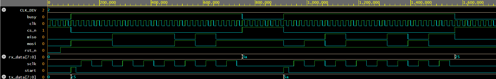

# 03. SPI Master Controller (Mode 0)

## Overview
A synthesizable, parameterized SPI (Serial Peripheral Interface) Master Controller module designed in Verilog HDL. Implements full-duplex synchronous serial communication according to SPI Mode 0 ($CPOL = 0, CPHA = 0$).

## Features & Protocol Implementation
- **Protocol Configuration:**
  - $CPOL = 0$: Serial clock (`sclk`) idles LOW.
  - $CPHA = 0$: Data is driven/shifted on the falling edge of `sclk` and sampled on the rising edge.
- **Full-Duplex Architecture:** Transmits via `mosi` while simultaneously latching incoming serial bits from `miso`.
- **Clock Prescaler:** Parameterized division ratio (`CLK_DIV`) to derive SPI serial clock from high-speed system clock.
- **Control Interface:** 
  - `start`: 1-cycle trigger strobe.
  - `tx_data [7:0]`: Parallel data byte for transmission.
  - `rx_data [7:0]`: Parallel data byte received from slave.
  - `busy`: Hardware status flag indicating ongoing active communication frame.
  - `cs_n`: Active-low chip select line.

## Verification & Simulation
- **Simulator:** Icarus Verilog (`iverilog`) via EDA Playground.
- **Waveform Viewer:** EPWave.
- **Test Scenarios Covered:**
  1. Transfer of byte `0xC5` with slave inversion loopback returning `0x3A` into `rx_data`.
  2. Sequential back-to-back transfer of `0x5A` returning `0x25`.
  3. Proper assertion and de-assertion verification of `cs_n` framing boundaries and SCLK clock gating.

### Simulation Waveform

