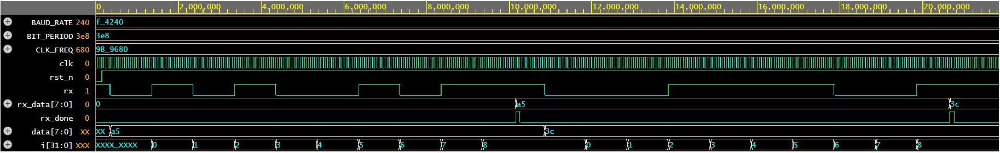

# 04. Configurable UART Receiver (RX) with Metastability Hardening

## Overview
A synthesizable, parameterized UART (Universal Asynchronous Receiver-Transmitter) receiver designed in Verilog HDL. The module samples serial bitstreams using mid-bit oversampling and deserializes framing into an 8-bit parallel data word.

## Architecture & Specifications
- **Baud Rate Generator:** Parameterized counter derived from `CLK_FREQ` and `BAUD_RATE`.
- **Clock Domain Crossing (CDC) Protection:** Implements a 2-stage flip-flop synchronizer on the asynchronous serial `rx` input pin to suppress metastability.
- **Glitch Filtering:** Half-bit period verification ($T_{bit}/2$) on the active-low Start bit to reject spurious noise spikes before transitioning from IDLE.
- **Mid-Bit Center Sampling:** Bit values are latched precisely at the middle of each bit period (`CLKS_PER_BIT - 1`) to ensure optimal setup and hold time margins.
- **Interface Ports:**
  - `clk`: System clock.
  - `rst_n`: Active-low asynchronous reset.
  - `rx`: Serial asynchronous input line (idles high).
  - `rx_data [7:0]`: Reconstructed parallel output byte.
  - `rx_done`: Single-cycle active-high strobe indicating successful frame capture.

## FSM State Implementation
The receiver operates across four hardware states:
1. **IDLE (`3'b000`):** Continuously monitors synchronized `rx` pin for a transition to LOW.
2. **START (`3'b001`):** Counts to $T_{bit}/2$; validates whether the line is genuinely held LOW or returns to IDLE if a false glitch occurred.
3. **DATA (`3'b010`):** Samples serial bits 0 through 7 sequentially on successive bit centers into an internal shift register.
4. **STOP (`3'b011`):** Confirms stop bit completion, drives `rx_done = 1'b1`, and updates `rx_data`.

## Verification & Simulation
- **Simulator:** Icarus Verilog (`iverilog`) via EDA Playground.
- **Waveform Viewer:** EPWave.
- **Test Scenarios Covered:**
  1. Serial injection of byte `0xA5` (`10100101b`) with timing analysis on bit-counter indexing and deserialized capture.
  2. Sequential injection of byte `0x3C` (`00111100b`) confirming proper reset of bit pointers and repeated `rx_done` assertion.

### Simulation Waveform

