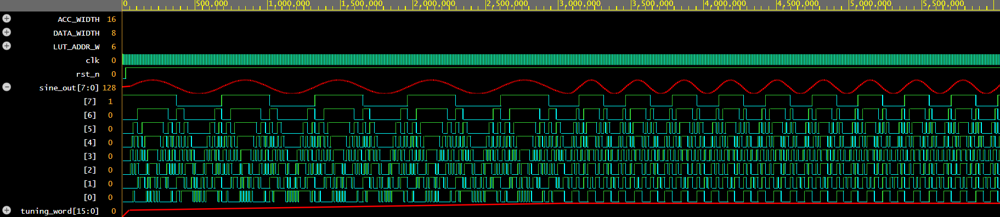

# 05. Direct Digital Synthesis (DDS) / Sine Wave NCO

## Overview
A synthesizable, parameterized Direct Digital Synthesizer (DDS) / Numerically Controlled Oscillator (NCO) implemented in Verilog HDL. The architecture dynamically synthesizes precise, phase-continuous sinusoidal signals using an accumulator-driven phase truncation method indexing a pre-computed 64-entry Sine Look-Up Table (LUT).

## Mathematical Formulation
The generated output frequency ($f_{out}$) is governed by the standard DDS tuning equation:
$$f_{out} = \frac{M \times f_{clk}}{2^N}$$

Where:
- $f_{clk}$ = Input system clock frequency (100 MHz in simulation)
- $N$ = Bit-width of the Phase Accumulator (`ACC_WIDTH = 16`)
- $M$ = Frequency Tuning Word (`tuning_word`)

## Architecture & Specifications
- **Phase Accumulator:** 16-bit register incrementing by step value $M$ on every clock edge.
- **Phase Truncation:** Maps the 6 most significant bits (MSBs) of the accumulator to a 64-depth LUT address space ($2^6 = 64$).
- **Sine Amplitude ROM (LUT):** 64 samples quantized to 8-bit unsigned dynamic range (centered at DC offset `128`).
- **Interface Ports:**
  - `clk`: 100 MHz reference clock.
  - `rst_n`: Active-low asynchronous reset.
  - `tuning_word [15:0]`: Frequency control input word ($M$).
  - `sine_out [7:0]`: 8-bit quantized discrete sine wave output.

## Verification & Simulation
- **Simulator:** Icarus Verilog (`iverilog`) via EDA Playground.
- **Waveform Viewer:** EPWave (Analog interpolation mode).
- **Test Scenarios Covered:**
  1. Base frequency synthesis at tuning word $M = 1024$ (`16'h0400`).
  2. Phase-continuous dynamic frequency step test: Doubling tuning word to $M = 2048$ (`16'h0800`) demonstrating instantaneous, phase-continuous frequency doubling without phase discontinuities or glitches.

### Simulation Waveform

