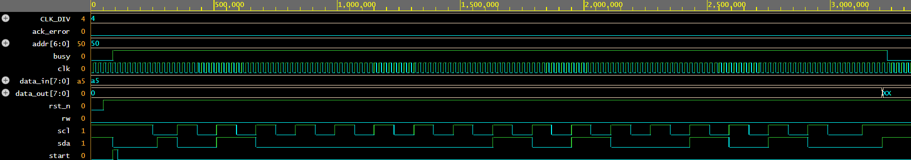

# 06. Parameterized I2C Master Controller (Single-Master, Open-Drain)

## Overview
A synthesizable, parameterizable I2C (Inter-Integrated Circuit) Master controller module implemented in Verilog HDL. Designed according to standard I2C protocol timing, it handles byte-write and byte-read operations with START/STOP generation, tri-state open-drain bus driving, and slave ACK/NACK verification.

## Architecture & Protocol Specifications
- **Open-Drain Bus Emulation:** Employs bidirectional `inout sda` driven using tri-state logic (`1'b0` when active low, `1'bz` to release to external pull-up).
- **Framing Sequence:**
  - **START:** `sda` pulled low while `scl` is high.
  - **7-bit Addressing + R/W:** Transmits device address alongside read/write direction bit.
  - **Acknowledge (ACK/NACK):** Samples incoming slave pull-down response during the 9th SCL clock cycle. Sets `ack_error` flag upon protocol violation.
  - **Data Byte Transfer:** Serializes 8-bit payloads (MSB first).
  - **STOP:** `sda` transitioned from low to high while `scl` is high.
- **Clock Prescaler:** Parameterized division counter (`CLK_DIV`) deriving SCL from arbitrary reference clocks.
- **Hardware Ports:**
  - `clk`: Reference clock input.
  - `rst_n`: Active-low asynchronous reset.
  - `start`: Single-cycle trigger strobe.
  - `addr [6:0]`: 7-bit target slave address.
  - `rw`: Control line (0 for Write, 1 for Read).
  - `data_in [7:0]`: Parallel data input byte.
  - `data_out [7:0]`: Received data output byte.
  - `busy`: Status signal asserted during an active bus transaction.
  - `ack_error`: Flag indicating a missing slave acknowledge.
  - `scl`: Serial Clock line.
  - `sda`: Bidirectional Serial Data line.

## Verification & Simulation
- **Simulator:** Icarus Verilog (`iverilog`) via EDA Playground.
- **Waveform Viewer:** EPWave.
- **Test Scenarios Covered:**
  1. Full standard Byte Write frame targeting Slave Address `0x50` with payload `0xA5`.
  2. Protocol validation verifying non-assertion of `ack_error` with synchronized slave acknowledge emulation.
  3. Proper assertion of bus idle states (`busy = 0`, `scl = 1`, `sda = 1`).

### Simulation Waveform

