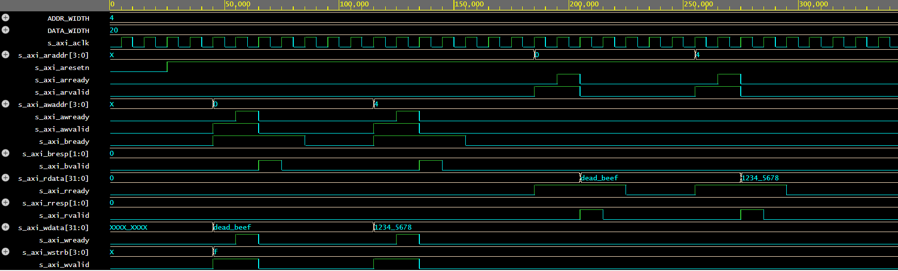

# 07. AXI4-Lite Slave Peripheral Interface (Memory-Mapped Registers)

## Overview
A fully synthesizable Arm AMBA AXI4-Lite Slave peripheral module implemented in Verilog HDL. The module implements memory-mapped configuration registers and adheres to strict two-way `VALID`/`READY` handshakes across all five independent AXI4-Lite communication channels.

## Architecture & Channel Implementation
- **Write Address Channel (AW):** Handshakes `s_axi_awvalid` and `s_axi_awready` to latch target register base offsets.
- **Write Data Channel (W):** Synchronously accepts 32-bit payloads via `s_axi_wvalid` and `s_axi_wready` with byte write-strobe masking support (`s_axi_wstrb`).
- **Write Response Channel (B):** Drives transfer status back to the bus master via `s_axi_bvalid`, `s_axi_bready`, and `s_axi_bresp` (`2'b00` = OKAY).
- **Read Address Channel (AR):** Latches read requests using `s_axi_arvalid` and `s_axi_arready`.
- **Read Data Channel (R):** Multiplexes internal memory-mapped register contents onto `s_axi_rdata` alongside `s_axi_rvalid` and `s_axi_rresp`.

## Register Memory Map
| Register Offset | Register Name | Access Type | Reset Value | Description |
| :---: | :---: | :---: | :---: | :---: |
| `0x0` | `slv_reg0` | Read / Write | `32'h00000000` | Control & Status Register 0 |
| `0x4` | `slv_reg1` | Read / Write | `32'h00000000` | User Configuration Register 1 |
| `0x8` | `slv_reg2` | Read / Write | `32'h00000000` | Diagnostic Register 2 |
| `0xC` | `slv_reg3` | Read / Write | `32'h00000000` | Scratchpad Data Register 3 |

## Verification & Simulation
- **Simulator:** Icarus Verilog (`iverilog`) via EDA Playground.
- **Waveform Viewer:** EPWave.
- **Test Scenarios Covered:**
  1. Synchronous write handshake of `32'hDEADBEEF` to Address `0x0` (`slv_reg0`).
  2. Synchronous write handshake of `32'h12345678` to Address `0x4` (`slv_reg1`).
  3. Validated write response cycles generating standard `OKAY` responses (`2'b00`).
  4. Back-to-back read transactions from offset addresses `0x0` and `0x4`, validating accurate readback without bus contention or stale data cycles.

### Simulation Waveform

