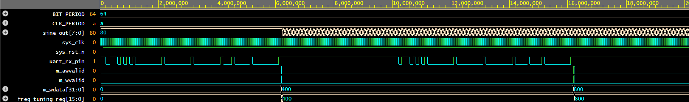

# 08. SoC Peripheral Subsystem: UART-to-AXI4-Lite Command Bridge & Dynamic DDS NCO

## 1. Architectural Overview
This system-level design demonstrates the complete integration of heterogeneous digital IP cores into a cohesive System-on-Chip (SoC) peripheral architecture. It bridges an external asynchronous serial link (UART) to an internal memory-mapped interconnect (**AMBA AXI4-Lite**), enabling dynamic runtime frequency configuration of an on-chip **Direct Digital Synthesis (DDS / NCO)** sine generator.


```

┌────────────────────────────────────────────────────────────────────────────────────────┐
│                                SOC PERIPHERAL SUBSYSTEM                                │
│                                                                                        │
│  [Host UART RX]                                                                        │
│       │ 10 Mbps (Serial Pin)                                                           │
│       ▼                                                                                │
│  ┌───────────────────────┐                                                             │
│  │     UART Receiver     │                                                             │
│  │  - 2-Stage CDC Sync   │                                                             │
│  │  - Center Oversample  │                                                             │
│  └───────────┬───────────┘                                                             │
│              │ rx_byte[7:0] + rx_done pulse                                            │
│              ▼                                                                         │
│  ┌───────────────────────┐                                                             │
│  │  UART-to-AXI4 Bridge  │  Master Interface (AW, W, B Channels)                       │
│  │  Command Parser FSM   │─────────────────────────────────┐                           │
│  └───────────────────────┘                                 │                           │
│                                                            ▼                           │
│                                            ┌───────────────────────────────┐           │
│                                            │    AXI4-Lite Interconnect     │           │
│                                            │       Address Decoder         │           │
│                                            └───────────────┬───────────────┘           │
│                                                            │ Offset: 0x00              │
│                                                            ▼                           │
│                                            ┌───────────────────────────────┐           │
│                                            │      AXI DDS Peripheral       │           │
│                                            │   - freq_tuning_reg (16-bit)  │           │
│                                            │   - Handshake Response (BRESP)│           │
│                                            └───────────────┬───────────────┘           │
│                                                            │ 16-bit Tuning Word        │
│                                                            ▼                           │
│                                            ┌───────────────────────────────┐           │
│                                            │        DDS Sine Engine        │           │
│                                            │   - 16-bit Phase Accumulator  │           │
│                                            │   - 64-Word Sine LUT          │           │
│                                            └───────────────┬───────────────┘           │
│                                                            │                           │
│                                                            ▼                           │
│                                                      sine_out[7:0]                     │
└────────────────────────────────────────────────────────────────────────────────────────┘

```

---

## 2. Key Microarchitectural Features

### Clock Domain Crossing (CDC) & Metastability Hardening
- External serial line `uart_rx_pin` crosses into the internal `100 MHz` clock domain via a **2-stage flip-flop synchronizer** (`rx_sync1`, `rx_sync`) to prevent setup/hold violations and eliminate metastability.
- Mid-bit center-sampling filter provides false start-bit glitch rejection.

### Protocol Translation FSM
- Translates high-latency asynchronous serial frames into synchronous, decoupled 5-channel AXI4-Lite transactions.
- **Deterministic 6-Byte Serial Frame Format:**
  - `Byte 0`: Opcode (`0x57` = ASCII `'W'` for Write transaction)
  - `Byte 1`: Peripheral Base Register Address Offset (`0x00`)
  - `Bytes 2-5`: 32-bit Data Payload (`Big-Endian`: `[31:24]`, `[23:16]`, `[15:8]`, `[7:0]`)

### AMBA AXI4-Lite Interface Compliance
- Fully decoupled Write Address (`AW`) and Write Data (`W`) channels with independent `VALID`/`READY` handshakes.
- Handshake completion drives explicit `BRESP = 2'b00` (OKAY response) on the Write Response (`B`) channel.

### Real-Time DDS / NCO Signal Modulation
- Memory-mapped register offset `0x00` routes directly to the phase accumulator step input.
- Enables **phase-continuous frequency modulation** on the fly with zero phase breaks or glitching.

---

## 3. Register Memory Map

| Register Name | Offset Address | Width | Access | Default Value | Description |
| :--- | :---: | :---: | :---: | :---: | :--- |
| `DDS_FREQ_CTRL` | `0x00` | 16-bit | R/W | `0x0000` | Frequency tuning word controlling DDS phase accumulator step ($f_{out} = \frac{\Delta\text{Phase} \times f_{clk}}{2^{16}}$) |
| `RESERVED` | `0x04 - 0x0C` | 32-bit | - | - | Reserved for future peripheral expansion |

---

## 4. Verification & Simulation Results

The subsystem was verified using an end-to-end directed testbench on **Icarus Verilog** and inspected using **EPWave**:

1. **Transaction 1: Baseline Frequency Setup (~6,000,000 ps)**
   - The testbench transmits a 6-byte UART frame: `['W', 0x00, 0x00, 0x00, 0x04, 0x00]`.
   - The bridge unpacks the frame and asserts `m_awvalid` and `m_wvalid`.
   - The AXI slave captures `0x0400` (1024 decimal) into `freq_tuning_reg`.
   - Output `sine_out[7:0]` transitions immediately from idle (`0x80`) into continuous sinusoidal oscillation.

2. **Transaction 2: Dynamic Frequency Doubling (~17,000,000 ps)**
   - A secondary UART frame is injected: `['W', 0x00, 0x00, 0x00, 0x08, 0x00]`.
   - AXI bus executes a synchronized write cycle, updating `freq_tuning_reg` to `0x0800` (2048 decimal).
   - The synthesized output frequency doubles instantaneously without phase discontinuities.

### Functional Verification Waveform


*The waveform above demonstrates serial frame arrival on `uart_rx_pin`, followed by single-cycle AXI handshakes (`m_awvalid`, `m_wvalid`), register update on `freq_tuning_reg`, and instantaneous frequency modulation on `sine_out[7:0]`.*

---

## 5. Directory Structure

```text
08_AXI4_Lite_SOC_Peripheral_Subsystem/
├── soc_subsystem_top.v          # Synthesizable Top-Level & Sub-module RTL
├── soc_subsystem_tb.v           # End-to-end Verification Testbench
├── soc_subsystem_waveform.png   # EPWave simulation capture
└── README.md                    # Technical documentation and architecture specification

```

---
```

```
